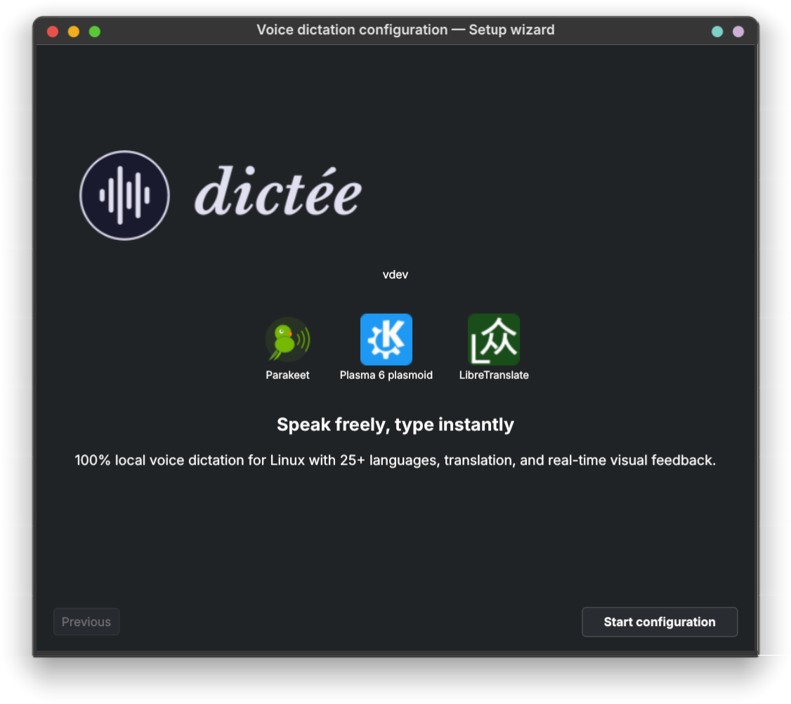

<p align="center">
  <picture>
        <source media="(prefers-color-scheme: light)" srcset="assets/banner-light.svg">
        <source media="(prefers-color-scheme: dark)" srcset="assets/banner-dark.svg">
    
  </picture>
</p>

<p align="center">
  <b><i>Parler, c'est plus simple.</i></b>
</p>

<p align="center">
  <b>Parlez librement, tapez instantanément</b> — dictée vocale 100% locale pour Linux avec 25+ langues, traduction, diarisation et retour visuel en temps réel. Le texte apparaît directement sous votre curseur.
</p>

<p align="center">
  <a href="https://github.com/rcspam/dictee/releases"></a>
  <a href="LICENSE"></a>
  
  
  
</p>

<p align="center">
  <a href="#installation">Installation</a> &bull;
  <a href="#configuration">Configuration</a> &bull;
  <a href="#interfaces-visuelles">Interfaces visuelles</a> &bull;
  <a href="#utilisation">Utilisation</a> &bull;
  <a href="#pour-aller-plus-loin">Pour aller plus loin</a> &bull;
  <a href="#feuille-de-route">Feuille de route</a>
</p>

---

**dictee** est un système complet de dictée vocale pour Linux. La transcription est réalisée **100% en local** — aucune donnée audio ne quitte votre machine. Appuyez sur un raccourci, parlez, et le texte est tapé directement dans l'application active.

- **4 backends ASR** : [Parakeet-TDT](https://huggingface.co/istupakov/parakeet-tdt-0.6b-v3-onnx) (25 langues, ponctuation native), [Canary-1B](https://huggingface.co/nvidia/canary-1b) (traduction intégrée, GPU), [Vosk](https://alphacephei.com/vosk/) (léger, ~50 Mo), [faster-whisper](https://github.com/SYSTRAN/faster-whisper) (99 langues)
- **Mode daemon** : modèle chargé une seule fois, transcriptions quasi-instantanées (~0,8s sur CPU)
- **Traduction** : 4 backends — Google, Bing, LibreTranslate (local), ollama (local)
- **Diarisation** : identification des locuteurs, jusqu'à 4 via Sortformer (CLI uniquement, pas encore dans la dictée vocale)
- **3 interfaces visuelles** : widget KDE Plasma, icône de notification, animation plein écran

<p align="center">
  <br>
  
</p>

---

## Installation

Télécharger le `.deb` depuis les [Releases](../../releases), puis :

```bash
# Version GPU (nécessite le dépôt NVIDIA CUDA — voir « Dépendances CUDA » ci-dessous)
sudo dpkg -i dictee-cuda_1.2.0_amd64.deb

# Version CPU (tout ordinateur, aucun dépôt supplémentaire requis)
sudo dpkg -i dictee-cpu_1.2.0_amd64.deb

# Installer les dépendances manquantes
sudo apt-get install -f
```

> **Note :** La version GPU nécessite cuDNN provenant du [dépôt NVIDIA CUDA](#version-gpu--dépendances-nvidia-cuda), qui n'est pas inclus dans les dépôts standards Ubuntu/Fedora. Sans celui-ci, la version GPU fonctionnera en mode CPU uniquement.

**Fedora / openSUSE :**

```bash
# Version GPU (NVIDIA CUDA — voir « Dépendances CUDA » ci-dessous)
sudo dnf install ./dictee-cuda-1.2.0-1.x86_64.rpm

# Version CPU (tout ordinateur)
sudo dnf install ./dictee-cpu-1.2.0-1.x86_64.rpm
```

**Arch Linux (AUR) :**

Un `PKGBUILD` est disponible à la racine du dépôt. Il compile depuis les sources et inclut tous les composants (x86_64 et aarch64).

**aarch64 (ARM64) :**

Les paquets pré-compilés sont x86_64 uniquement. Sur aarch64 (Raspberry Pi 5, Ampere, etc.), compilez depuis les sources — voir ci-dessous. CUDA est limité aux NVIDIA Jetson sur cette architecture ; la plupart des utilisateurs utiliseront le mode CPU.

**Autres distributions (.tar.gz) :**

```bash
tar xzf dictee-1.2.0_amd64.tar.gz
cd dictee-1.2.0
sudo ./install.sh
```

**Depuis les sources :**

```bash
tar xzf dictee-1.2.0-source.tar.gz
cd dictee-1.2.0-source
cargo build --release --features sortformer
sudo ./install.sh
```

> Pour les instructions de compilation détaillées et les features Cargo, voir [docs/building.md](docs/building.md).

### Version GPU : dépendances NVIDIA CUDA

La version GPU (`dictee-cuda`) nécessite cuDNN, qui n'est **pas disponible** dans les dépôts standards Ubuntu/Fedora. Il faut ajouter le dépôt NVIDIA CUDA :

**Ubuntu / Debian :**

```bash
wget -qO - https://developer.download.nvidia.com/compute/cuda/repos/ubuntu2404/x86_64/3bf863cc.pub | \
  sudo gpg --dearmor -o /usr/share/keyrings/cuda-archive-keyring.gpg
echo "deb [signed-by=/usr/share/keyrings/cuda-archive-keyring.gpg] \
  https://developer.download.nvidia.com/compute/cuda/repos/ubuntu2404/x86_64/ /" | \
  sudo tee /etc/apt/sources.list.d/cuda-ubuntu2404-x86_64.list
sudo apt update
sudo apt install libcudnn9-cuda-12
```

> Remplacer `ubuntu2404` par votre version (`ubuntu2204`, `ubuntu2504`, etc.). Voir [dépôts NVIDIA CUDA](https://developer.download.nvidia.com/compute/cuda/repos/).

**Fedora :**

```bash
sudo dnf config-manager addrepo --from-repofile=https://developer.download.nvidia.com/compute/cuda/repos/fedora41/x86_64/cuda-fedora41.repo
sudo dnf install libcudnn9-cuda-12
```

> Sans cuDNN, la version GPU fonctionne automatiquement en mode CPU. `dictee-setup` détectera le problème et vous guidera.

### Dépendances

| Debian / Ubuntu | Fedora / openSUSE | Arch Linux |
|-----------------|-------------------|------------|
| `pipewire` | `pipewire` | `pipewire` |
| `dotool` | — (inclus) | `dotool` |
| `ffmpeg` | `ffmpeg-free` | `ffmpeg` |
| `libnotify-bin` | `libnotify` | `libnotify` |
| `python3-pyqt6` | `python3-pyqt6` | `python-pyqt6` |
| `python3-pyqt6.qtmultimedia` | `python3-qt6-multimedia` | `python-pyqt6-multimedia` |
| `python3-gi` | `python3-gobject` | `python-gobject` |
| `wl-clipboard` / `xclip` | `wl-clipboard` / `xclip` | `wl-clipboard` / `xclip` |

---

## Configuration

Après installation, lancez `dictee --setup` pour tout configurer depuis une interface graphique :

<p align="center">
  
</p>

### Backend ASR

Quatre backends de transcription mutuellement exclusifs, commutables depuis `dictee --setup` :

| Backend | Langues | Taille modèle | Daemon chaud | Type |
|---------|---------|----------------|--------------|------|
| **Parakeet-TDT** (défaut) | 25 | ~2,5 Go | ~0,8s | ONNX Runtime (Rust) |
| **Canary-1B** | 4 (EN,ES,FR,DE) | ~5 Go | ~0,7s (GPU) | ONNX Runtime (Python, GPU recommandé) |
| **Vosk** | 9+ | ~50 Mo | ~1,5s | Python (léger) |
| **faster-whisper** | 99 | ~500 Mo–3 Go | ~0,3s | CTranslate2 (Python) |

Chaque backend tourne en service systemd utilisateur — même protocole socket Unix, totalement transparent pour l'utilisateur.

### Raccourcis clavier

`dictee --setup` capture et enregistre les raccourcis automatiquement (KDE Plasma / GNOME). Deux raccourcis séparés : un pour la dictée, un pour la dictée + traduction.

> Pour les WM tiling (Sway, i3, Hyprland…), l'outil indique la commande à ajouter manuellement à votre config.

### Traduction

| Backend | Confidentialité | Vitesse | Qualité | Installation |
|---------|-----------------|---------|---------|--------------|
| **translate-shell** (Google) | En ligne | 0,2–0,7s | Bonne | `apt install translate-shell` |
| **translate-shell** (Bing) | En ligne | 1,7–2,2s | Bonne | `apt install translate-shell` |
| **LibreTranslate** | 100% local | 0,1–0,3s | Bonne | Docker (~2 Go d'image) |
| **ollama** | 100% local | 2,3–3,4s | Meilleure | ollama + modèle translategemma |

### Changement rapide de backend

Changez de backend ASR ou traduction instantanément depuis la ligne de commande, le menu du tray ou le widget Plasma :

```bash
# Changer de backend ASR
dictee-switch-backend asr canary

# Changer de backend traduction
dictee-switch-backend translate ollama

# Voir les backends actifs
dictee-switch-backend status
# → ASR: parakeet (dictee.service, active)
# → Translate: google (trans)
```

Le tray et le widget Plasma incluent des sous-menus pour changer de backend sans ouvrir la configuration.

---

## Interfaces visuelles

### Widget KDE Plasma

Un widget natif KDE Plasma 6 avec visualisation audio en temps réel pendant l'enregistrement, état du daemon et contrôles rapides (dictée, traduction, annulation).

<p align="center">
  
</p>

<p align="center">
  
</p>

Cinq styles d'animation avec enveloppe Hanning, sensibilité par style et dégradés de couleurs optionnels :

| Barres | Onde | Pulsation | Points | Forme d'onde |
|:------:|:----:|:---------:|:------:|:------------:|
|  |  |  |  |  |

Tous les styles supportent les dégradés de couleurs, une enveloppe Hanning ajustable (forme et fréquence centrale), une courbe de sensibilité par style, et des options de réglage fin (nombre de barres, espacement, rayon, vitesse…).

```bash
# Installer (inclus dans le .deb, ou manuellement)
kpackagetool6 -t Plasma/Applet -i /usr/share/dictee/dictee.plasmoid
```

Clic droit sur le panneau → « Ajouter des composants graphiques… » → chercher « Dictée ».

> Pour la documentation complète des réglages du widget, voir [docs/plasmoid.md](docs/plasmoid.md).

### Icône de zone de notification (dictee-tray)

`dictee-tray` est l'alternative au widget KDE Plasma pour les bureaux non-KDE (GNOME, Xfce, Sway, Hyprland…). Il affiche une icône dans la zone de notification qui reflète l'état en temps réel : idle, enregistrement (vert), transcription (bleu), daemon arrêté (rouge).

<p align="center">
  
</p>

- Clic gauche → lancer une dictée
- Clic molette → annuler
- Menu contextuel → toutes les actions (dictée, traduction, daemon, configuration)

```bash
# Lancer manuellement
dictee-tray

# Activer au démarrage de la session
systemctl --user enable --now dictee-tray
```

L'icône s'adapte automatiquement au thème clair/sombre.

Le widget Plasma et le tray incluent tous deux :
- **Sélecteurs de backend** — changer de backend ASR et traduction sans ouvrir `dictee-setup`
- **Détection premier lancement** — propose de lancer l'assistant de configuration si pas encore configuré
- **Détection d'installation** (widget Plasma) — affiche un message clair si dictee n'est pas installé

### animation-speech

[animation-speech](https://github.com/rcspam/animation-speech) est un projet autonome qui fournit une animation visuelle plein écran pendant l'enregistrement, avec annulation via la touche Echap. Il fonctionne sur tout compositeur Wayland supportant `wlr-layer-shell` (KDE Plasma, Sway, Hyprland…).

<p align="center">
  <a href="https://youtu.be/-fWZZEO7mCA">
    
  </a>
</p>

```bash
sudo dpkg -i animation-speech_1.2.0_all.deb
```

> Télécharger : [releases animation-speech](https://github.com/rcspam/animation-speech/releases)

> **Note :** animation-speech n'est pas compatible GNOME (pas de support `wlr-layer-shell`). Les utilisateurs GNOME peuvent utiliser `dictee-tray` pour le retour visuel. Les contributions pour une extension GNOME Shell sont les bienvenues — voir le [code source du plasmoid](plasmoid/) comme architecture de référence.

Sans aucune interface visuelle, `dictee` fonctionne normalement mais sans retour visuel pendant l'enregistrement.

---

## Utilisation

```bash
# Dictée simple — transcrit et tape
dictee

# Avec traduction (défaut : langue système → anglais)
dictee --translate
dictee --translate --ollama    # traduction 100% locale via ollama

# Changer les langues de traduction
DICTEE_LANG_TARGET=es dictee --translate    # → espagnol

# Annuler l'enregistrement en cours (via raccourci ou touche Echap)
dictee --cancel

# Tester les règles de post-traitement
dictee-test-rules                    # mode interactif
dictee-test-rules --loop             # boucle de test continue
dictee-test-rules --wav fichier.wav  # tester depuis un fichier audio

# Changer de backend en ligne de commande
dictee-switch-backend status         # voir les backends actifs
dictee-switch-backend asr canary     # passer à Canary
dictee-switch-backend translate bing # traduction vers Bing
```

---

## Pour aller plus loin

### Post-traitement

dictee inclut un pipeline configurable de transformation du texte qui s'exécute après la transcription :

- **Règles personnalisées** — remplacement par regex (ex : commandes vocales « à la ligne », « virgule »)
- **Dictionnaire** — corriger les erreurs récurrentes de l'ASR
- **Continuation** — détecter les phrases incomplètes entre plusieurs dictées
- **Élisions** — règles de grammaire française (ex : « le arbre » → « l'arbre »)
- **Conversion des nombres** — nombres dictés en chiffres (ex : « vingt-trois » → « 23 »)
- **Capitalisation automatique** — majuscule après ponctuation finale
- **Correction LLM** — correction optionnelle grammaire/orthographe via Ollama avant les règles

Configuration depuis `dictee --setup` → onglet Post-traitement, ou testez les règles avec `dictee-test-rules`.

| Documentation | Description |
|---------------|-------------|
| [docs/cli-programs.md](docs/cli-programs.md) | Binaires CLI, utilisation directe, modèles ONNX |
| [docs/building.md](docs/building.md) | Compilation depuis les sources, features Cargo, pipeline audio |
| [docs/plasmoid.md](docs/plasmoid.md) | Réglages du widget, styles d'animation, configuration détaillée |
| [Post-traitement](docs/postprocessing.md) | Pipeline de transformation du texte : règles, dictionnaire, élisions, text2num, capitalisation, correction LLM |

---

## Feuille de route

**v1.2.0 (actuelle) :** 4 backends ASR (+ Canary), pipeline de post-traitement, changement rapide de backend, assistant premier lancement, `dictee-test-rules`

- (v1.3) **Hotword boosting** — biaiser le décodage ASR vers des noms et termes personnalisés sans ré-entraîner (beam search + Aho-Corasick en Rust)
- Diarisation depuis le tray/plasmoid — sélection de fichier audio, transcription avec identification des locuteurs
- CLI speech-to-text (pipe audio, récupérer le texte)
- Coordinateur `dictee-ctl` — point d'entrée unique, élimine les race conditions
- VAD (Voice Activity Detection) — dictée mains libres sans push-to-talk
- Transcription streaming temps réel avec affichage en direct
- Overlay visuel intégré (remplacer `animation-speech` externe)
- Packaging AppImage / Flatpak
- Applet COSMIC / GNOME (contributions bienvenues !)

## Crédits

Le moteur de transcription s'appuie sur [parakeet-rs](https://github.com/altunenes/parakeet-rs) par [Enes Altun](https://github.com/altunenes), qui fournit la bibliothèque Rust pour l'inférence des modèles NVIDIA Parakeet via ONNX Runtime. Le backend Canary-1B utilise [onnx-asr](https://github.com/istupakov/onnx-asr) par [Ivan Stupakov](https://github.com/istupakov) pour l'inférence ASR via ONNX.

## Licence

Ce projet est distribué sous licence **GPL-3.0-or-later** (voir [LICENSE](LICENSE)).

Le code original de [parakeet-rs](https://github.com/altunenes/parakeet-rs) par Enes Altun est sous licence MIT (voir [LICENSE-MIT](LICENSE-MIT)).

[dotool](https://sr.ht/~geb/dotool/) par geb est intégré pour la simulation de saisie clavier et est sous licence GPL-3.0.

Les modèles ONNX Parakeet (téléchargés séparément depuis HuggingFace) sont fournis par NVIDIA. Ce projet ne distribue pas les modèles.
