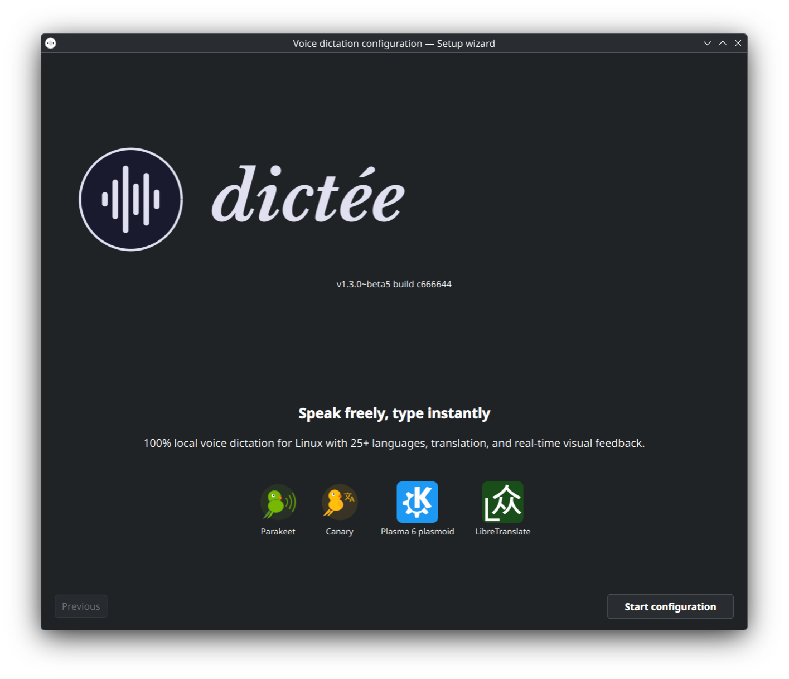
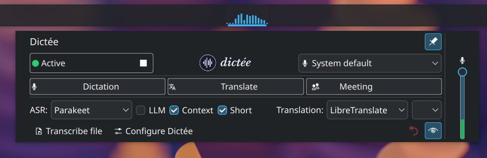
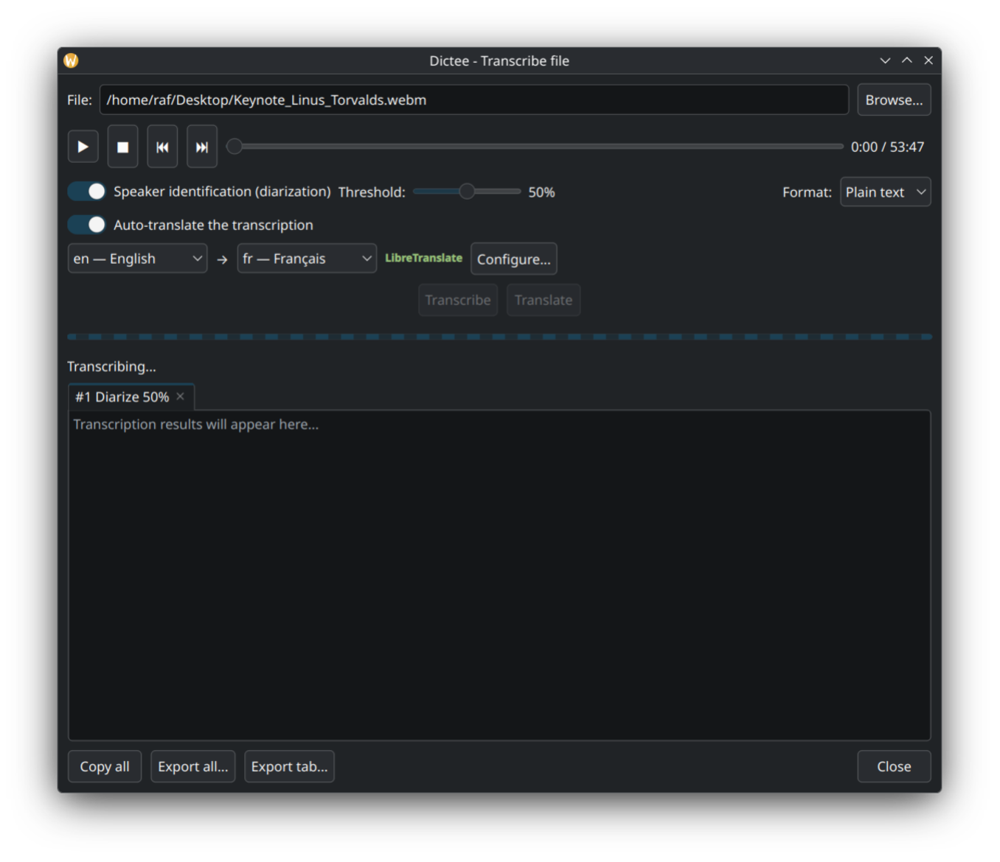
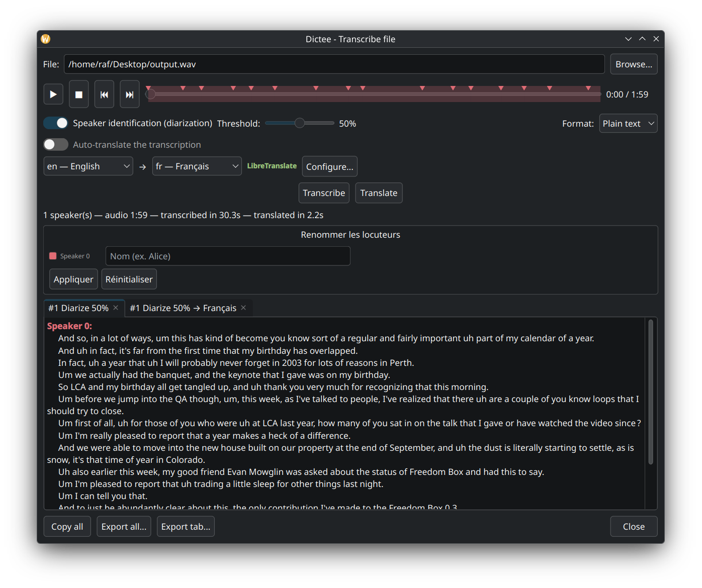
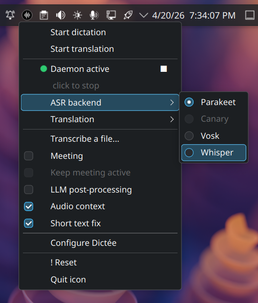
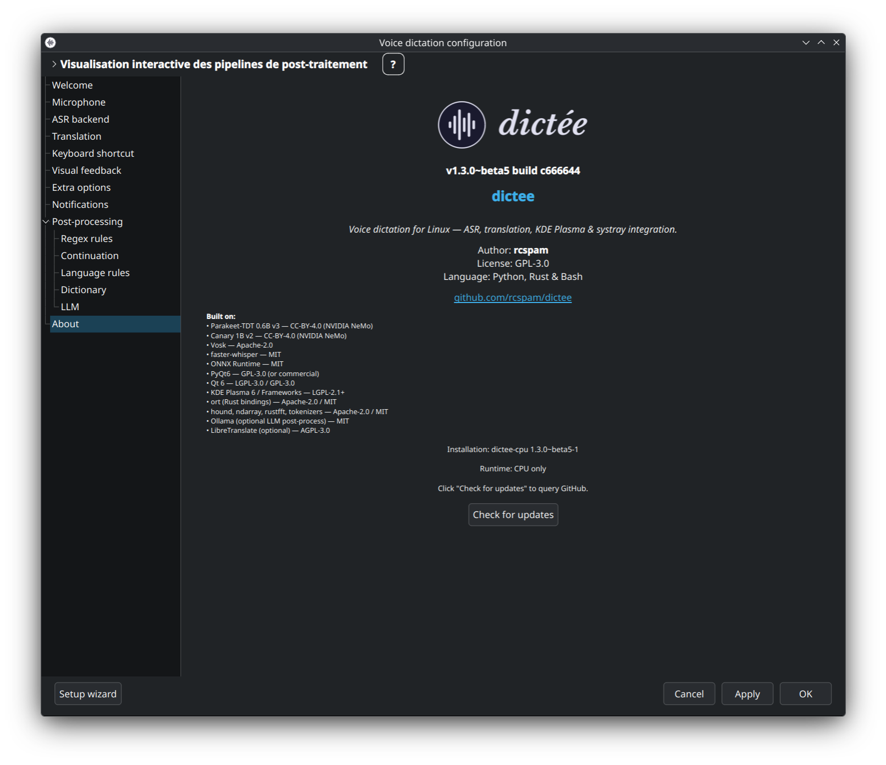
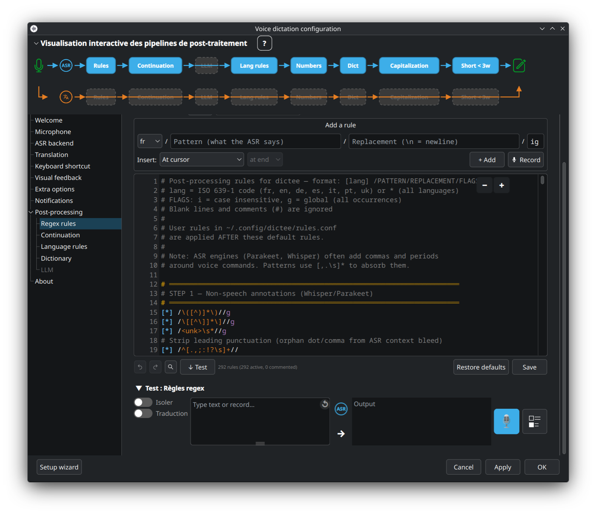
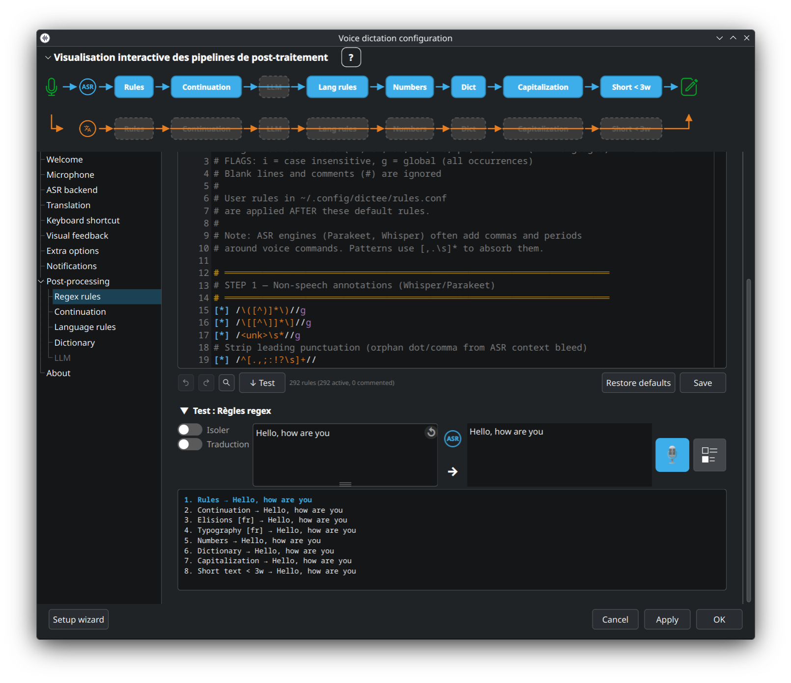

<p align="center">
  <picture>
    <source media="(prefers-color-scheme: dark)" srcset="assets/banner-dark.svg">
    <source media="(prefers-color-scheme: light)" srcset="assets/banner-light.svg">
    
  </picture>
</p>

<p align="center">
  <b><i>Parler, c'est juste plus simple.</i></b>
</p>

<p align="center">
  <b>Parlez librement, le texte apparaît instantanément</b> — dictée vocale 100 % locale pour Linux avec 25+ langues, 5 backends de traduction, diarisation des locuteurs et retour visuel en temps réel. Le texte s'écrit directement à l'endroit de votre curseur.
</p>

<p align="center">
  <a href="https://github.com/rcspam/dictee/releases"></a>
  <a href="LICENSE"></a>
  
  
  
  <a href="https://github.com/rcspam/dictee/wiki"></a>
</p>

<p align="center">
  <a href="#quest-ce-que-dictée-">Qu'est-ce que dictée ?</a> &bull;
  <a href="#démarrage-rapide">Démarrage rapide</a> &bull;
  <a href="#fonctionnalités">Fonctionnalités</a> &bull;
  <a href="#installation">Installation</a> &bull;
  <a href="#configuration">Configuration</a> &bull;
  <a href="#utilisation">Utilisation</a> &bull;
  <a href="#post-traitement">Post-traitement</a> &bull;
  <a href="#limitations-connues">Limitations</a> &bull;
  <a href="#feuille-de-route">Feuille de route</a> &bull;
  <a href="https://github.com/rcspam/dictee/wiki">Wiki</a>
</p>

---

## Qu'est-ce que dictée ?

**dictée** est un système complet de dictée vocale pour Linux. Appuyez sur un raccourci, parlez, et le texte est tapé directement dans l'application active — n'importe quelle application, n'importe quelle fenêtre, n'importe quel champ de saisie.

La transcription est effectuée **100 % localement** par défaut : aucun audio ne quitte votre machine à moins que vous ne choisissiez explicitement un backend de traduction en ligne.

- 🔒 **100 % local par défaut** — Parakeet, Canary, faster-whisper et Vosk tournent tous hors ligne sur votre matériel
- 🌍 **25+ langues** — avec ponctuation et capitalisation natives (Parakeet-TDT)
- 🔀 **4 backends ASR** — changez instantanément selon la langue, la latence et le matériel
- 🎨 **Retour visuel** — widget KDE Plasma, icône systray, ou animation plein écran

---

## Démarrage rapide

Trois étapes pour passer de zéro à la dictée en moins de deux minutes :

**1. Installer**

```bash
curl -fsSL https://raw.githubusercontent.com/rcspam/dictee/master/install.sh | bash
```

**2. Configurer**

L'assistant de premier lancement vous guide pour la sélection du backend, le téléchargement du modèle et l'association du raccourci clavier. Relancez à tout moment via `dictee --setup`.

<p align="center">
  
</p>

**3. Parler**

Appuyez sur votre raccourci (par défaut **F9**), parlez, relâchez. La transcription apparaît au curseur.

<p align="center">
  
</p>

Pour les chemins d'installation détaillés (`.deb`/`.rpm` manuels, prérequis GPU, AUR, depuis les sources), voir la section [Installation](#installation) ci-dessous ou les pages wiki [Installation](https://github.com/rcspam/dictee/wiki/Installation) et [GPU-Setup](https://github.com/rcspam/dictee/wiki/GPU-Setup).

---

## Fonctionnalités

### 4 backends ASR

| Backend | Langues | Taille modèle | Latence chaude | Notes |
|---------|---------|---------------|----------------|-------|
| **Parakeet-TDT 0.6B v3** | 25 | ~2,5 Go | ~0,8s CPU · ~0,16s GPU | Par défaut, ponctuation native |
| **Canary-1B v2** | 4 (EN/ES/FR/DE) | ~5 Go | ~0,7s GPU | Traduction intégrée |
| **faster-whisper** | 99 | ~500 Mo–3 Go | ~0,3s | Large couverture linguistique |
| **Vosk** | 20+ | ~50 Mo | ~1,5s | Léger, strictement hors ligne |

Chaque backend tourne comme service systemd utilisateur avec le même protocole socket Unix — le changement est transparent. → [Wiki ASR-Backends](https://github.com/rcspam/dictee/wiki/ASR-Backends)

### 5 backends de traduction

| Backend | Confidentialité | Vitesse | Qualité | Langues |
|---------|-----------------|---------|---------|---------|
| **Canary-1B** | 🔒 Local | Intégré | Excellente | 4 |
| **LibreTranslate** | 🔒 Local | 0,1–0,3s | Bonne | 30+ |
| **Ollama** | 🔒 Local | 2–3s | Excellente | Toutes (LLM) |
| **Google Translate** | 🌐 Cloud | 0,2–0,7s | Excellente | 130+ |
| **Bing Translator** | 🌐 Cloud | 1,7–2,2s | Très bonne | 100+ |

→ [Wiki Translation](https://github.com/rcspam/dictee/wiki/Translation) · [Ollama-Setup](https://github.com/rcspam/dictee/wiki/Ollama-Setup)

### Pipeline de post-traitement

Un pipeline configurable en 12 étapes transforme la sortie ASR brute avant qu'elle n'atteigne votre curseur :

- **Règles regex + dictionnaire** — 7 langues, variantes ASR, commandes vocales → [Rules-and-Dictionary](https://github.com/rcspam/dictee/wiki/Rules-and-Dictionary)
- **Correction LLM** — polissage optionnel de la fluidité via Ollama local (position first / last / hybrid) → [LLM-Correction](https://github.com/rcspam/dictee/wiki/LLM-Correction)
- **Nombres & dates** — cardinaux, ordinaux, versions, décimales, heures en français → [Numbers-Dates-Continuation](https://github.com/rcspam/dictee/wiki/Numbers-Dates-Continuation)
- **Tampon de continuation** — continuer une phrase entre deux dictées avec mémoire du dernier mot
- **Short-text keepcaps** — exceptions par langue pour sigles et noms propres (nouveauté v1.3)

→ [Post-Processing-Overview](https://github.com/rcspam/dictee/wiki/Post-Processing-Overview)

### Diarisation des locuteurs (Meetings)

Répond à la question *« qui a parlé et quand ? »* dans les enregistrements multi-locuteurs via le modèle **Sortformer** de NVIDIA. Jusqu'à 4 locuteurs, idéal pour les comptes rendus de réunion et les interviews. Déclenché via le **mode Meeting** ou `dictee --meeting`. → [Wiki Diarization](https://github.com/rcspam/dictee/wiki/Diarization)

<p align="center">
  
</p>

<p align="center">
  
</p>

### 3 interfaces visuelles

- **Widget KDE Plasma 6** — plasmoid QML natif, 5 styles d'animation, état en direct → [Plasmoid-Widget](https://github.com/rcspam/dictee/wiki/Plasmoid-Widget)
- **Icône systray** — PyQt6, fonctionne sur GNOME/XFCE/Sway (repli AppIndicator) → [Tray-Icon](https://github.com/rcspam/dictee/wiki/Tray-Icon)
- **animation-speech** (externe) — overlay plein écran sur compositeurs `wlr-layer-shell`

Les trois interfaces partagent leur état via un surveillant de fichier — toute modification est reflétée instantanément (sûr en multi-utilisateur via suffixe UID).

<p align="center">
  
</p>

<p align="center">
  
</p>

#### animation-speech (overlay plein écran)

[animation-speech](https://github.com/rcspam/animation-speech) est un projet autonome qui fournit une animation visuelle plein écran pendant l'enregistrement, annulable via la touche Échap. Il fonctionne sur tout compositeur Wayland qui supporte `wlr-layer-shell` (KDE Plasma, Sway, Hyprland…).

<p align="center">
  <a href="https://youtu.be/-fWZZEO7mCA">
    
  </a>
</p>

```bash
sudo dpkg -i animation-speech_1.2.0_all.deb
```

> Téléchargement : [releases animation-speech](https://github.com/rcspam/animation-speech/releases)

> **Note :** animation-speech n'est pas compatible avec GNOME (pas de support `wlr-layer-shell`). Les utilisateurs GNOME peuvent s'appuyer sur `dictee-tray` pour le retour visuel. Les contributions pour une extension GNOME Shell sont bienvenues — voir la [source du plasmoid](plasmoid/) comme architecture de référence.

---

## Installation

### Une ligne (recommandé)

Détecte automatiquement votre distribution et votre GPU, ajoute le dépôt CUDA NVIDIA si nécessaire, installe le bon paquet :

```bash
curl -fsSL https://raw.githubusercontent.com/rcspam/dictee/master/install.sh | bash
```

Pris en charge : **Ubuntu, Debian, Fedora, openSUSE, Arch Linux**. Les autres distributions basculent sur le tarball.

**Options** (après `--`) :

```bash
# Forcer CPU (ignorer la détection GPU)
curl -fsSL https://raw.githubusercontent.com/rcspam/dictee/master/install.sh | bash -s -- --cpu

# Forcer GPU (CUDA)
curl -fsSL https://raw.githubusercontent.com/rcspam/dictee/master/install.sh | bash -s -- --gpu

# Épingler une version précise
curl -fsSL https://raw.githubusercontent.com/rcspam/dictee/master/install.sh | bash -s -- --version 1.3.0

# Non interactif
curl -fsSL https://raw.githubusercontent.com/rcspam/dictee/master/install.sh | bash -s -- --non-interactive
```

### Installation manuelle

Téléchargez depuis [Releases](../../releases).

**Ubuntu / Debian (CPU) :**

```bash
sudo apt install ./dictee-cpu_1.3.0_amd64.deb
```

**Ubuntu / Debian (GPU) :** nécessite le dépôt APT CUDA NVIDIA — voir [GPU-Setup](https://github.com/rcspam/dictee/wiki/GPU-Setup) pour la configuration unique, puis :

```bash
sudo apt install ./dictee-cuda_1.3.0_amd64.deb
```

**Fedora / openSUSE (CPU) :**

```bash
sudo dnf install ./dictee-cpu-1.3.0-1.x86_64.rpm
```

**Fedora / openSUSE (GPU) :** ajoutez d'abord le dépôt CUDA (voir [GPU-Setup](https://github.com/rcspam/dictee/wiki/GPU-Setup)), puis `dictee-cuda-1.3.0-1.x86_64.rpm`.

**Arch Linux (AUR) :** `PKGBUILD` à la racine du dépôt (x86_64 + aarch64). Clonez + `makepkg -si`.

**aarch64 / Jetson :** pas de paquet pré-construit — compilez depuis les sources. CUDA limité aux cartes NVIDIA Jetson.

**Autres distros (tarball) :**

```bash
tar xzf dictee-1.3.0_amd64.tar.gz
cd dictee-1.3.0
sudo ./install.sh
```

**Depuis les sources :** `cargo build --release --features sortformer` puis `sudo ./install.sh`. Voir [Developer-Guide](https://github.com/rcspam/dictee/wiki/Developer-Guide) pour la liste complète des features Cargo et les scripts de build.

---

## Configuration

Au premier lancement, un **assistant de configuration** vous guide (backend, modèle, raccourcis).

<p align="center">
  
</p>

Reconfigurez à tout moment depuis le menu de l'application, l'icône systray, le widget Plasma, ou en lançant :

```bash
dictee --setup
```

<p align="center">
  
</p>

### Changement de backend (une ligne)

```bash
# Afficher les backends actuels
dictee-switch-backend status

# Changer l'ASR (parakeet · canary · whisper · vosk)
dictee-switch-backend asr canary

# Changer la traduction (canary · libretranslate · ollama · google · bing)
dictee-switch-backend translate ollama
```

Le systray et le plasmoid incluent des sous-menus de backend — pas besoin de terminal.

Pour la configuration détaillée (tous les backends ASR, matrice de traduction, réglages plasmoid, raccourcis sur WM en mosaïque), voir le wiki :

- [ASR-Backends](https://github.com/rcspam/dictee/wiki/ASR-Backends) · [Translation](https://github.com/rcspam/dictee/wiki/Translation)
- [Plasmoid-Widget](https://github.com/rcspam/dictee/wiki/Plasmoid-Widget) · [Tray-Icon](https://github.com/rcspam/dictee/wiki/Tray-Icon)
- [Keyboard-Shortcuts](https://github.com/rcspam/dictee/wiki/Keyboard-Shortcuts) (KDE/GNOME/Sway/i3/Hyprland)

---

## Utilisation

```bash
# Dictée simple — transcrire et taper
dictee

# Dictée + traduction (par défaut : langue système → anglais)
dictee --translate
dictee --translate --ollama            # 100 % local via Ollama

# Changer la langue cible
DICTEE_LANG_TARGET=es dictee --translate   # → espagnol

# Mode réunion (diarisation, jusqu'à 4 locuteurs)
dictee --meeting

# Annuler une dictée en cours
dictee --cancel

# Tester les règles de post-traitement en direct
dictee-test-rules                       # interactif
dictee-test-rules --loop                # boucle continue
dictee-test-rules --wav fichier.wav     # depuis un fichier audio
```

→ Référence complète des commandes : [Wiki CLI-Reference](https://github.com/rcspam/dictee/wiki/CLI-Reference)

---

## Post-traitement

dictée exécute un **pipeline configurable de 12 étapes** après transcription et avant collage :

1. Normalisation des variantes ASR
2. Substitution du dictionnaire
3. Conversion nombres & dates
4. Fusion avec le tampon de continuation
5. Règles regex (pré-LLM)
6. Correction LLM *(optionnelle, position first)*
7. Règles regex (post-LLM)
8. Exceptions short-text (keepcaps)
9. Mode de correspondance étendu
10. Capitalisation finale
11. Traduction *(optionnelle)*
12. Collage / injection

Configurez via `dictee --setup` → onglet **Post-traitement**, ou testez les règles en direct avec `dictee-test-rules`.

<p align="center">
  
</p>

<p align="center">
  
</p>

→ Approfondissements : [Post-Processing-Overview](https://github.com/rcspam/dictee/wiki/Post-Processing-Overview) · [Rules-and-Dictionary](https://github.com/rcspam/dictee/wiki/Rules-and-Dictionary) · [LLM-Correction](https://github.com/rcspam/dictee/wiki/LLM-Correction) · [Numbers-Dates-Continuation](https://github.com/rcspam/dictee/wiki/Numbers-Dates-Continuation)

---

## Limitations connues

- **Diarisation + Parakeet sur GPU 8 Go** plafonne à environ **10–15 min d'audio**. Parakeet-TDT charge le mel-spectrogramme complet en une passe (~185 Mo de VRAM par minute d'audio), ce qui déborde les GPU grand public au-delà d'environ 15 min. Contournements : découper le fichier, désactiver la diarisation, ou utiliser le backend CPU. L'auto-chunking est prévu pour la release v1.3 finale. → [Wiki Diarization](https://github.com/rcspam/dictee/wiki/Diarization)
- **GPU AMD / Intel** non pris en charge actuellement — dictée bascule sur CPU.
- **Pas de streaming temps réel** — Parakeet-TDT et Canary nécessitent l'utterance complète ; seul Nemotron (EN uniquement, via binaire Rust) streame nativement.

Pour les rapports de bugs et contournements, voir [Troubleshooting](https://github.com/rcspam/dictee/wiki/Troubleshooting).

---

## Feuille de route

**v1.3.0 (actuelle)** — Exceptions keepcaps short-text (7 langues), mode de correspondance étendu, purge des modèles LibreTranslate, corrections continuation + traduction, dictée des numéros de version, sûreté multi-utilisateur (suffixe UID sur les fichiers d'état), toggles cross-process du plasmoid (LLM / Short / Meeting), 682 tests postprocess + 148 tests pipeline, bannière theme-aware.

**v1.4+ (prévu)**
- **Diarisation chunked** — traiter les fichiers > 15 min via `transcribe-diarize-batch` (prototype validé : 54 min en 122 s)
- **Hotword boosting** — biaiser le décodage ASR vers des noms personnalisés (shallow fusion sur les logits TDT, Parakeet uniquement)
- **Whisper translate** — traduction multi-cible via `task="translate"` (EN uniquement, hors ligne)
- **Backend Moonshine** CPU
- **CLI speech-to-text** — piper de l'audio, récupérer du texte
- **VAD** — dictée mains libres sans push-to-talk
- **Transcription streaming** avec affichage en direct
- **Overlay intégré** — remplacer `animation-speech` externe
- Packaging **AppImage / Flatpak**
- Applets **COSMIC / GNOME Shell** (contributions bienvenues !)

→ Historique complet : [Wiki Changelog](https://github.com/rcspam/dictee/wiki/Changelog)

---

## Crédits

Le moteur de transcription s'appuie sur [parakeet-rs](https://github.com/altunenes/parakeet-rs) par [Enes Altun](https://github.com/altunenes) — bibliothèque Rust pour l'inférence NVIDIA Parakeet via ONNX Runtime. L'implémentation Rust du backend Canary a initialement été portée depuis [onnx-asr](https://github.com/istupakov/onnx-asr) par [Ivan Stupakov](https://github.com/istupakov) et est désormais entièrement autonome. Les modèles ONNX Parakeet et Canary sont fournis par NVIDIA (téléchargés séparément depuis HuggingFace, non redistribués par ce projet).

La simulation de saisie clavier utilise [dotool](https://sr.ht/~geb/dotool/) par geb (GPL-3.0).

## Licence

Ce projet est distribué sous licence **GPL-3.0-or-later** (voir [LICENSE](LICENSE)).

Le code original [parakeet-rs](https://github.com/altunenes/parakeet-rs) par Enes Altun est sous licence MIT (voir [LICENSE-MIT](LICENSE-MIT)). [dotool](https://sr.ht/~geb/dotool/) est inclus sous GPL-3.0.
