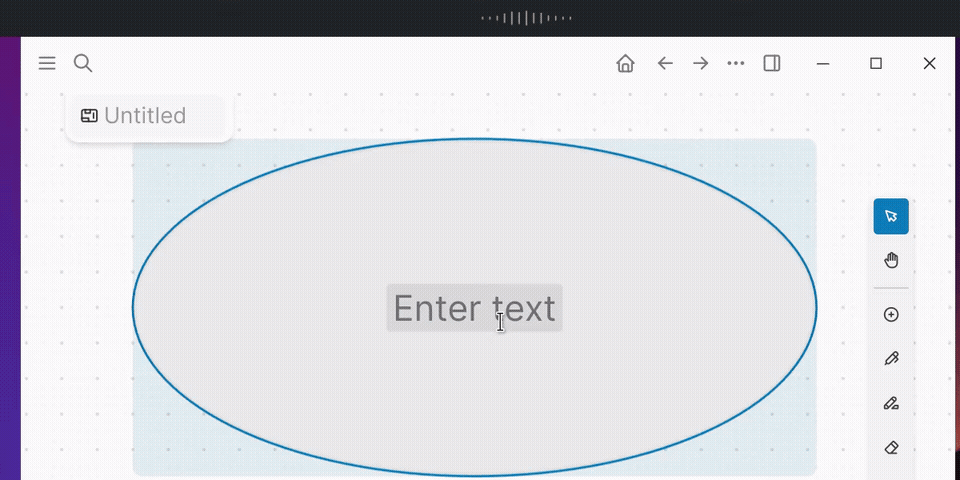
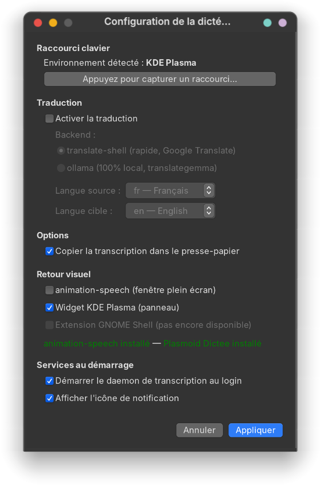
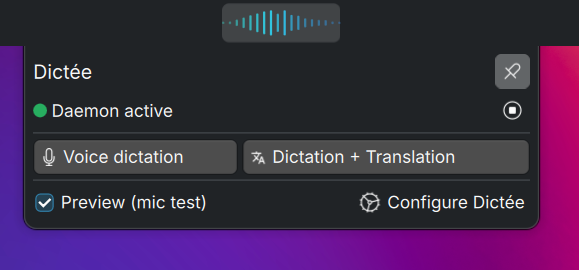
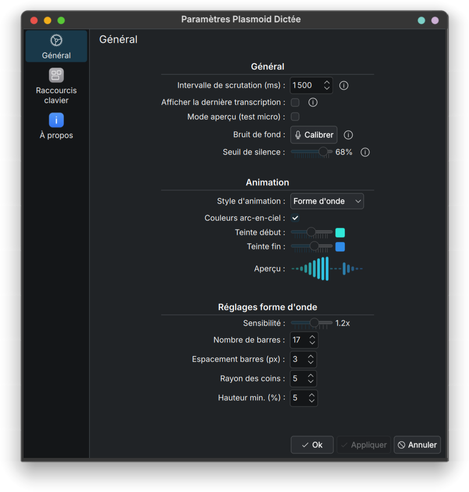
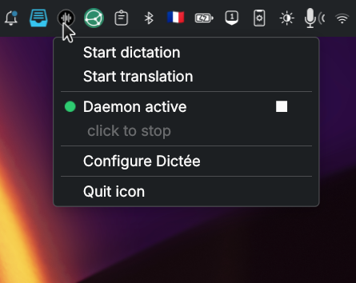
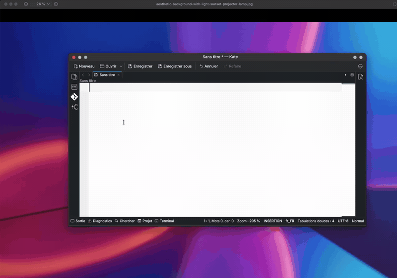

<p align="center">
  <picture>
    <source media="(prefers-color-scheme: dark)" srcset="assets/banner-dark.svg">
    <source media="(prefers-color-scheme: light)" srcset="assets/banner-light.svg">
    
  </picture>
</p>

<p align="center">
  <b>Push-to-talk voice dictation for Linux</b> — speak, and the text is typed at the cursor position. With optional translation.
</p>

<p align="center">
  <a href="https://github.com/rcspam/dictee/releases"></a>
  <a href="LICENSE"></a>
  
  
  
</p>

<p align="center">
  <a href="README.fr.md">Lire en Fran&ccedil;ais</a>
</p>

---

<p align="center">
  <b>KDE Plasma widget</b><br>
  <a href="https://youtu.be/c6MyyW4LarE">
    
  </a>
</p>

**dictee** is a complete voice dictation system for Linux. Transcription is performed **100% locally** — no audio data ever leaves your machine. Press a shortcut, speak, and the text is typed directly into the active application.

- **3 ASR backends**: [Parakeet-TDT](https://huggingface.co/istupakov/parakeet-tdt-0.6b-v3-onnx) (25 languages, native punctuation), [Vosk](https://alphacephei.com/vosk/) (lightweight, ~50 MB), [faster-whisper](https://github.com/SYSTRAN/faster-whisper) (99 languages)
- **Daemon mode**: model loaded once, near-instant transcriptions (~0.8s on CPU)
- **Translation**: 4 backends — Google, Bing, LibreTranslate (local), ollama (local)
- **Speaker diarization**: who said what, up to 4 speakers via Sortformer
- **3 visual interfaces**: KDE Plasma widget, notification area icon, fullscreen animation

---

## Installation

Download the `.deb` from the [Releases](../../releases), then:

```bash
# GPU version (NVIDIA CUDA)
sudo dpkg -i dictee-cuda_1.0.0_amd64.deb

# CPU version (any computer)
sudo dpkg -i dictee-cpu_1.0.0_amd64.deb

# Install missing dependencies
sudo apt-get install -f
```

For non-Debian distributions, a `.tar.gz` archive is also available:

```bash
tar xzf dictee-1.0.0_amd64.tar.gz
cd dictee-1.0.0
sudo ./install.sh
```

### Dependencies

```bash
# Main dependencies (included in .deb)
sudo apt install pipewire dotool libnotify-bin python3-gi gir1.2-ayatanaappindicator3-0.1

# Optional — clipboard copy
sudo apt install wl-clipboard
```

---

## Configuration

After installation, run `dictee --setup` to configure everything from a graphical interface:

<p align="center">
  
</p>

### ASR backend

Three mutually exclusive transcription backends, switchable from `dictee --setup`:

| Backend | Languages | Model size | Warm daemon | Type |
|---------|-----------|------------|-------------|------|
| **Parakeet-TDT** (default) | 25 | ~2.5 GB | ~0.8s | ONNX Runtime (Rust) |
| **Vosk** | 9+ | ~50 MB | ~1.5s | Python (lightweight) |
| **faster-whisper** | 99 | ~500 MB–3 GB | ~0.3s | CTranslate2 (Python) |

Each backend runs as a systemd user service — same Unix socket protocol, fully transparent to the user.

### Keyboard shortcuts

`dictee --setup` captures and registers shortcuts automatically (KDE Plasma / GNOME). Two separate shortcuts: one for dictation, one for dictation + translation.

> For tiling WMs (Sway, i3, Hyprland…), the tool shows the command to add manually to your config.

### Translation

| Backend | Privacy | Speed | Quality | Setup |
|---------|---------|-------|---------|-------|
| **translate-shell** (Google) | Online | 0.2–0.7s | Good | `apt install translate-shell` |
| **translate-shell** (Bing) | Online | 1.7–2.2s | Good | `apt install translate-shell` |
| **LibreTranslate** | 100% local | 0.1–0.3s | Good | Docker (~2 GB image) |
| **ollama** | 100% local | 2.3–3.4s | Best | ollama + translategemma model |

---

## Visual interfaces

### KDE Plasma widget

A native KDE Plasma 6 widget with real-time audio visualization during recording, daemon status, and quick controls (dictate, translate, cancel).

| Widget popup (recording) | Configuration |
|:------------------------:|:-------------:|
|  |  |

Five animation styles with Hanning envelope, per-style sensitivity, and optional rainbow colors:

| Bars | Wave | Pulse | Dots | Waveform |
|:----:|:----:|:-----:|:----:|:--------:|
|  |  |  |  |  |

Rainbow mode: 

```bash
# Install (included in .deb, or manually)
kpackagetool6 -t Plasma/Applet -i /usr/share/dictee/dictee.plasmoid
```

Right-click on the panel → "Add Widgets…" → search for "Dictée".

> For full widget settings documentation, see [docs/plasmoid.md](docs/plasmoid.md).

### Notification area icon (dictee-tray)

`dictee-tray` is the alternative to the KDE Plasma widget for non-KDE desktops (GNOME, Xfce, Sway, Hyprland…). It displays a notification area icon reflecting the real-time state: idle, recording (green), transcribing (blue), daemon stopped (red).

<p align="center">
  
</p>

- Left click → start dictation
- Middle click → cancel
- Context menu → all actions (dictation, translation, daemon, configuration)

```bash
# Launch manually
dictee-tray

# Enable at session startup
systemctl --user enable --now dictee-tray
```

The icon automatically adapts to light/dark themes.

### animation-speech

[animation-speech](https://github.com/rcspam/animation-speech) is a standalone project that provides a fullscreen visual animation during recording, with cancellation via Escape key. It works on any Wayland compositor supporting `wlr-layer-shell` (KDE Plasma, Sway, Hyprland…).

<p align="center">
  <a href="https://youtu.be/-fWZZEO7mCA">
    
  </a>
</p>

```bash
sudo dpkg -i animation-speech_1.2.0_all.deb
```

> Download: [animation-speech releases](https://github.com/rcspam/animation-speech/releases)

> **Note:** animation-speech is not compatible with GNOME (no `wlr-layer-shell` support). GNOME users can use `dictee-tray` for visual feedback. Contributions for a GNOME Shell extension are welcome — see the [plasmoid source](plasmoid/) for reference architecture.

Without any visual interface, `dictee` works normally but without visual feedback during recording.

---

## Usage

```bash
# Simple dictation — transcribe and type
dictee

# With translation (default: system language → English)
dictee --translate
dictee --translate --ollama    # 100% local translation via ollama

# Change translation languages
DICTEE_LANG_TARGET=es dictee --translate    # → Spanish

# Cancel an ongoing recording (via shortcut or Escape key)
dictee --cancel
```

---

## Going further

| Documentation | Description |
|---------------|-------------|
| [docs/cli-programs.md](docs/cli-programs.md) | CLI binaries, direct usage, ONNX models |
| [docs/building.md](docs/building.md) | Building from source, Cargo features, audio pipeline |
| [docs/plasmoid.md](docs/plasmoid.md) | Widget settings, animation styles, configuration details |

---

## Credits

The transcription engine is built on [parakeet-rs](https://github.com/altunenes/parakeet-rs) by [Enes Altun](https://github.com/altunenes), which provides the Rust library for NVIDIA Parakeet model inference via ONNX Runtime.

## License

This project is distributed under the **GPL-3.0-or-later** license (see [LICENSE](LICENSE)).

The original [parakeet-rs](https://github.com/altunenes/parakeet-rs) code by Enes Altun is under the MIT license (see [LICENSE-MIT](LICENSE-MIT)).

[dotool](https://sr.ht/~geb/dotool/) by geb is bundled for keyboard input simulation and is under the GPL-3.0 license.

The Parakeet ONNX models (downloaded separately from HuggingFace) are provided by NVIDIA. This project does not distribute the models.
