# Architecture de la pile **dictée**

Cartographie complète du projet : qui fait quoi, qui parle à qui, où sont les données.

> Tous les diagrammes sont en Mermaid. Dans VS Code, utiliser l'extension *Markdown Preview Mermaid Support*. Sur GitHub, le rendu est natif.

---

## 1. Vue d'ensemble — les 6 grandes couches

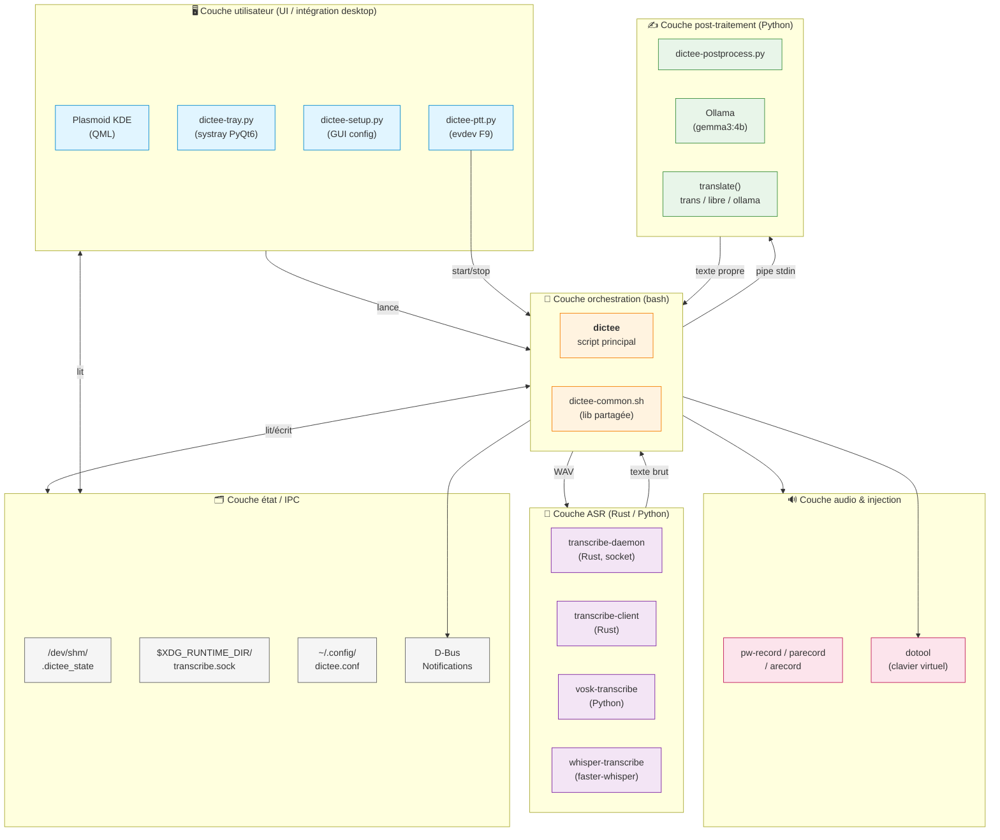

---

## 2. Pipeline d'une dictée (runtime, flux temporel)

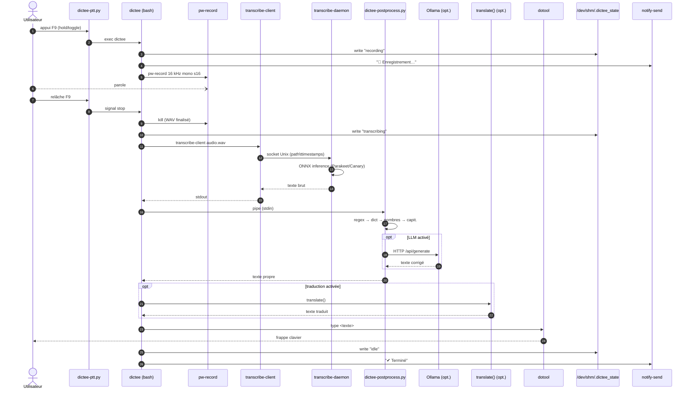

---

## 3. Dépendances entre processus (qui lance qui)

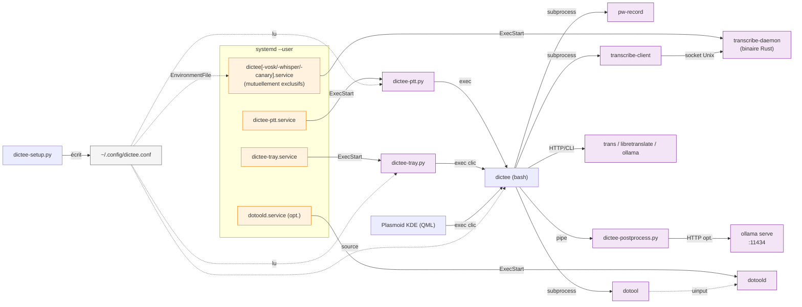

---

## 4. Backends ASR — détail

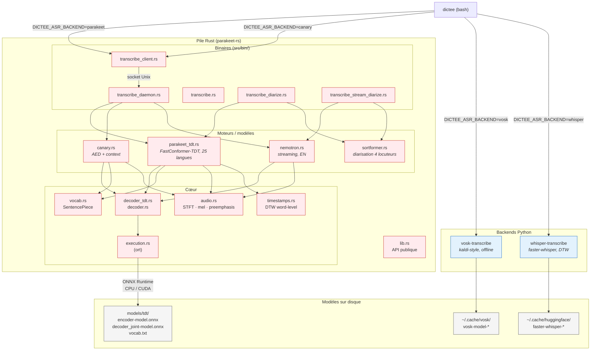

### Protocole socket `transcribe.sock`

| Requête envoyée au daemon | Réponse |
|---|---|
| `path.wav` | texte |
| `path.wav\ttimestamps` | texte + mots horodatés (Parakeet TDT) |
| `path.wav\tcontext:previous` | texte avec contexte décodeur (Canary) |
| `path.wav\tlang:fr` | texte avec override langue (Canary) |

---

## 5. Post-traitement — pipeline détaillé

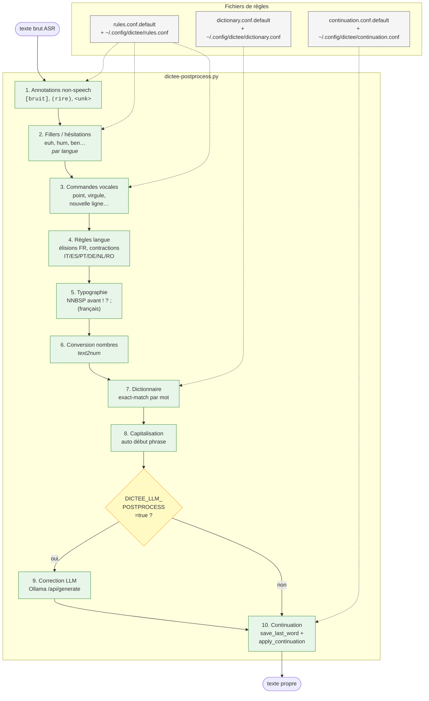

### Variables d'environnement de contrôle

| Variable | Défaut | Effet |
|---|---|---|
| `DICTEE_LANG_SOURCE` | `fr` | sélectionne les sections `[xx]` des fichiers de règles |
| `DICTEE_PP_RULES` | `true` | active regex (steps 1–3) |
| `DICTEE_PP_ELISIONS` | `true` | active règles langue (step 4) |
| `DICTEE_PP_NUMBERS` | `true` | active conversion nombres (step 6) |
| `DICTEE_LLM_POSTPROCESS` | `false` | active step 9 |
| `DICTEE_LLM_MODEL` | `gemma3:4b` | modèle Ollama |
| `DICTEE_LLM_TIMEOUT` | `10s` | garde-fou LLM |
| `DICTEE_LLM_POSITION` | `hybrid` | `first` \| `last` \| `hybrid` |

---

## 6. Machine à états (vue plasmoid / tray)

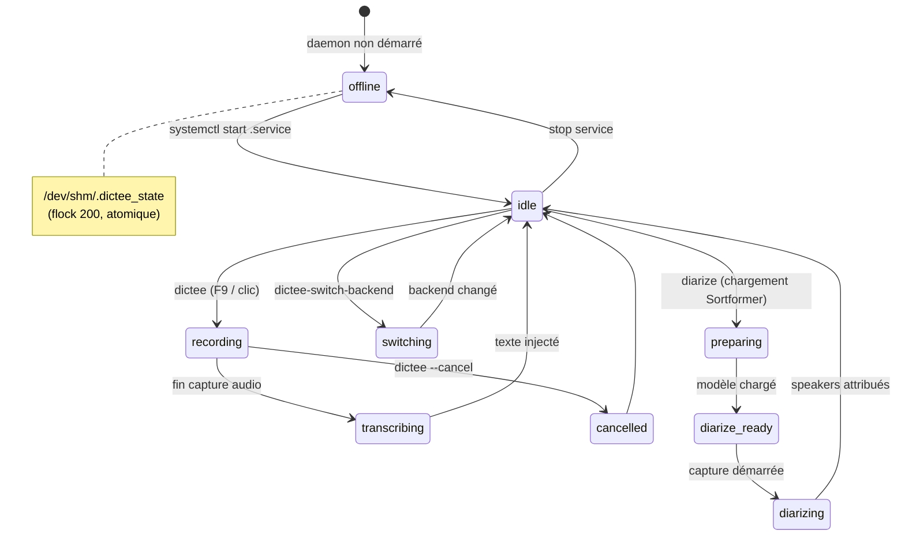

États exacts écrits dans `/dev/shm/.dictee_state` :
`offline` · `idle` · `recording` · `transcribing` · `cancelled` · `switching` · `preparing` · `diarize-ready` · `diarizing`

---

## 7. Entrées/sorties d'état et IPC

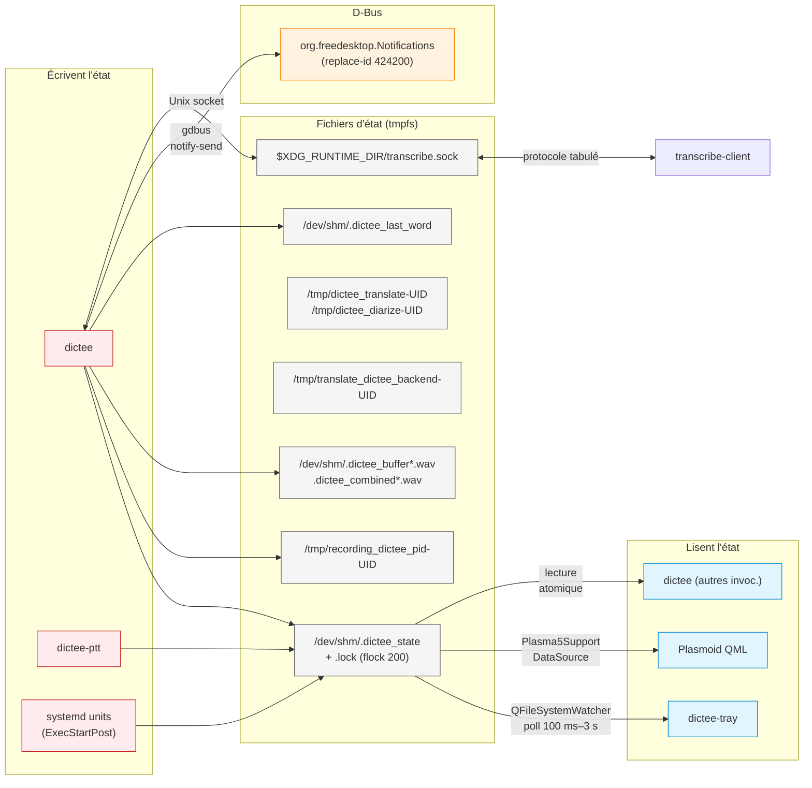

---

## 8. Traduction — les 4 voies

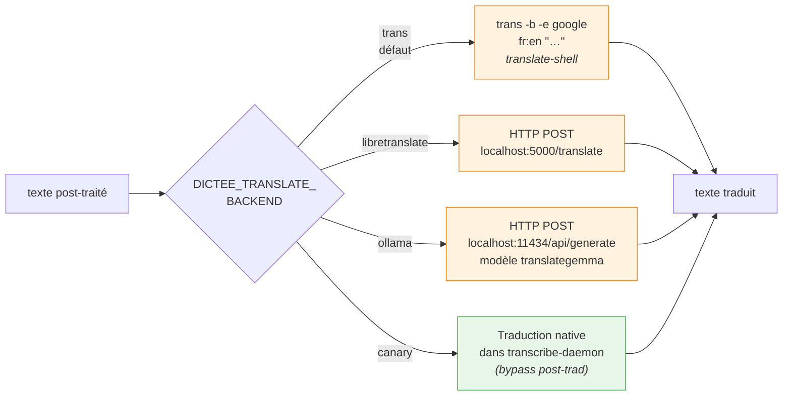

> ⚠️  Parakeet TDT ne supporte **pas** de traduction interne ; seul Canary le fait.

---

## 9. Audio — chaîne capture & injection

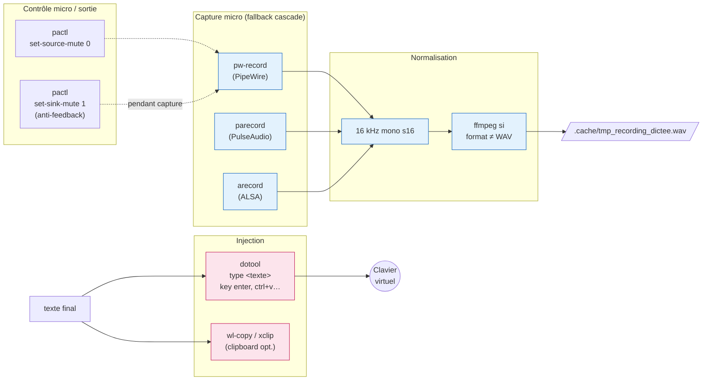

---

## 10. Configuration — sources et consommateurs

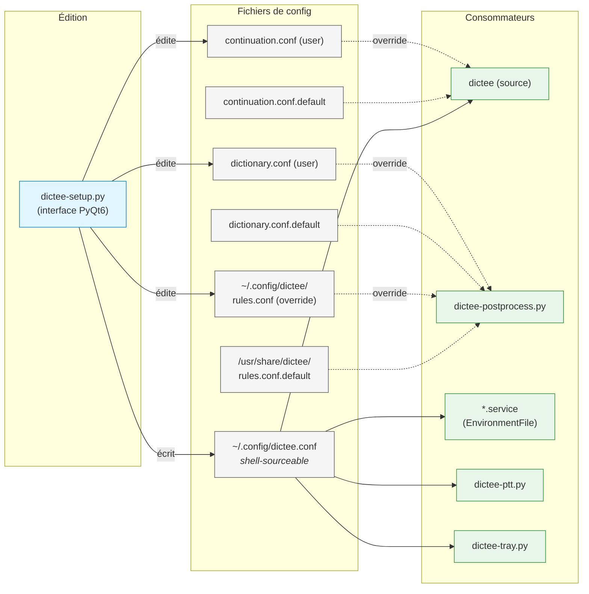

---

## 11. i18n — gettext à 3 domaines

| Composant | Domaine gettext | Fichiers |
|---|---|---|
| `dictee-setup.py`, `dictee-tray.py` | `dictee` | `po/{fr,de,es,it,uk,pt}.po` → `.mo` installés dans `~/.local/share/locale/` |
| Plasmoid KDE | `plasma_applet_com.github.rcspam.dictee` | `plasmoid/package/contents/locale/{fr,de,es,it,uk,pt}/` |
| `dictee.desktop` | inline | `Name[fr]=…`, `GenericName[fr]=…` |

6 langues UI supportées : **fr, de, es, it, uk, pt** (l'ASR, lui, gère 25 langues EU via Parakeet TDT).

---

## 12. Tests & CI

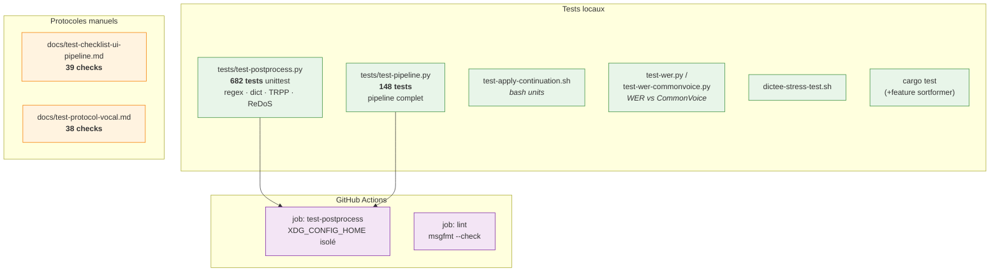

---

## 13. Build & packaging

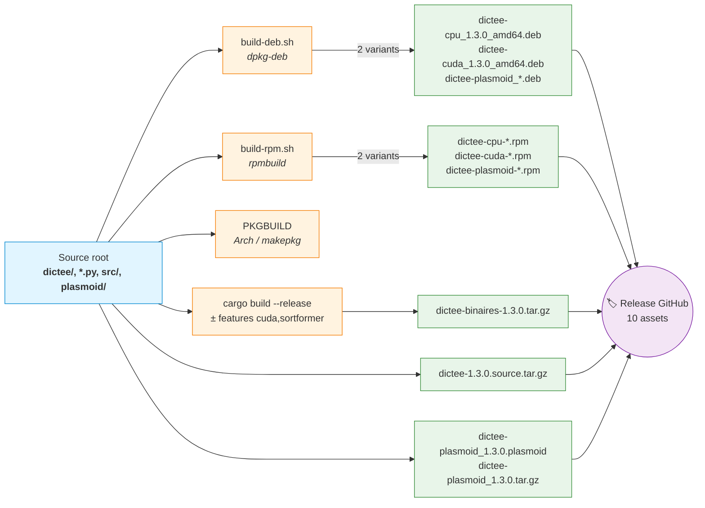

---

## 14. Tableau récapitulatif — qui fait quoi

| Fichier / binaire | Langage | Rôle | Appelé par | Appelle |
|---|---|---|---|---|
| `dictee` | bash | **Orchestrateur principal** | PTT, tray, plasmoid, CLI | pw-record, transcribe-client, postprocess.py, dotool, notify-send, trans/ollama |
| `dictee-common.sh` | bash | Lib partagée (state, notif, debug) | `dictee`, `dictee-ptt` | flock, gdbus |
| `dictee-setup.py` | PyQt6 | GUI config (wizard + pages) | user | écrit `dictee.conf`, `rules.conf`, `dictionary.conf`, `continuation.conf` |
| `dictee-tray.py` | PyQt6 / AppIndicator | Icône systray, état visuel | systemd user | subprocess `dictee` |
| `dictee-ptt.py` | Python evdev | Push-to-talk F9 (hold/toggle) | systemd user | `dictee` (start/stop) |
| `dictee-postprocess.py` | Python | Post-traitement 10 étapes | `dictee` (pipe) | Ollama (opt.), text2num |
| `transcribe-daemon` | Rust | ASR daemon (socket Unix) | systemd user | ONNX Runtime |
| `transcribe-client` | Rust | Envoie audio au daemon | `dictee` | socket, ffmpeg |
| `transcribe` | Rust | CLI 1-shot | debug | ONNX Runtime |
| `transcribe-diarize` | Rust | TDT + Sortformer | `dictee --diarize` | ONNX Runtime |
| `transcribe-stream-diarize` | Rust | Nemotron + Sortformer (EN) | scripts streaming | ONNX Runtime |
| `vosk-transcribe` | Python | Backend Vosk | `dictee` | vosk-api |
| `whisper-transcribe` | Python | Backend faster-whisper | `dictee` | faster-whisper |
| `plasmoid/` | QML | Widget KDE Plasma 6 | plasmashell | `dictee` via exec, `/dev/shm/.dictee_state` |
| `src/lib.rs` et modules | Rust | API ASR (Parakeet, Canary, Nemotron, Sortformer) | binaires `src/bin/` | ort, tokenizers, rustfft |

---

## 15. Chiffres clés

| | |
|---|---|
| **Lignes de `dictee`** | ~1700 (bash) |
| **Tests post-traitement** | 682 (unittest) |
| **Tests pipeline** | 148 |
| **Tests vocaux manuels** | 38 |
| **Tests UI manuels** | 39 |
| **Langues ASR** | 25 (EU via Parakeet TDT v3) |
| **Langues UI (gettext)** | 6 (fr, de, es, it, uk, pt) |
| **Backends ASR** | 4 (Parakeet, Canary, Vosk, Whisper) |
| **Backends traduction** | 4 (trans, LibreTranslate, Ollama, Canary interne) |
| **Assets release** | 10 (3 .deb + 3 .rpm + .plasmoid + 3 .tar.gz) |
| **États runtime** | 9 (offline → idle → recording → transcribing → … → diarizing) |

---

*Généré le 2026-04-15 — dictée v1.3.0 / master.*
