# Architecture système — services, scripts, IPC

Vue **plomberie système** de la pile dictée : services systemd, scripts shell/Python, fichiers d'état, sockets, D-Bus, liaisons exactes.

> Complément de [`architecture-pile.md`](architecture-pile.md) (vue applicative).

---

## 1. Les 7 services systemd (user-level)

Tous dans `~/.config/systemd/user/` (user install) ou `/usr/lib/systemd/user/` (paquet).

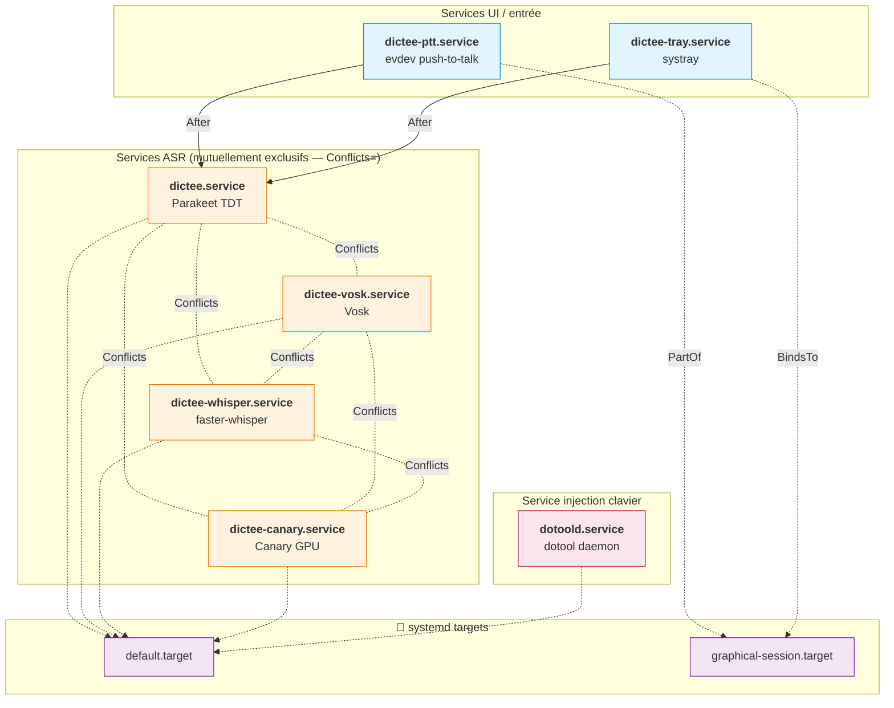

### Détails unit par unit

| Service | ExecStart | Restart | WantedBy / PartOf | `ExecStartPost` / `ExecStopPost` |
|---|---|---|---|---|
| `dictee.service` | `/usr/bin/transcribe-daemon` | `on-failure` (5 s) | `default.target` | `echo idle > /dev/shm/.dictee_state` / `echo offline > …` |
| `dictee-vosk.service` | `/usr/bin/transcribe-daemon-vosk` | `on-failure` (5 s) | `default.target` | idem |
| `dictee-whisper.service` | `/usr/bin/transcribe-daemon-whisper` | `on-failure` (5 s) | `default.target` | idem |
| `dictee-canary.service` | `/usr/bin/transcribe-daemon --canary` | `on-failure` (5 s) | `default.target` | idem |
| `dictee-ptt.service` | `/usr/bin/sg input -c "/usr/bin/dictee-ptt"` | `on-failure` (3 s) | `PartOf=graphical-session.target` | — |
| `dictee-tray.service` | `/usr/bin/dictee-tray` | `on-failure` (3 s) | `BindsTo=graphical-session.target` | — |
| `dotoold.service` | `/usr/bin/dotoold` | `on-failure` (2 s) | `default.target` | — |

**Env communes** : `EnvironmentFile=-%h/.config/dictee.conf`, `Environment=XDG_RUNTIME_DIR=/run/user/%U`.
**CUDA Parakeet** : `Environment=ORT_DYLIB_PATH=/usr/lib/dictee/libonnxruntime.so`.

---

## 2. Cycle de vie — démarrage à la session

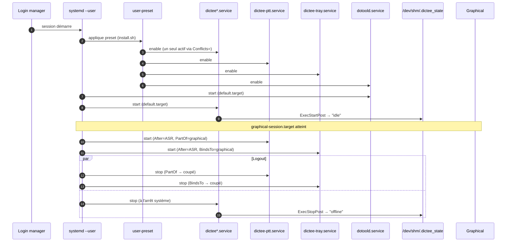

---

## 3. Liaisons entre scripts — qui lance qui

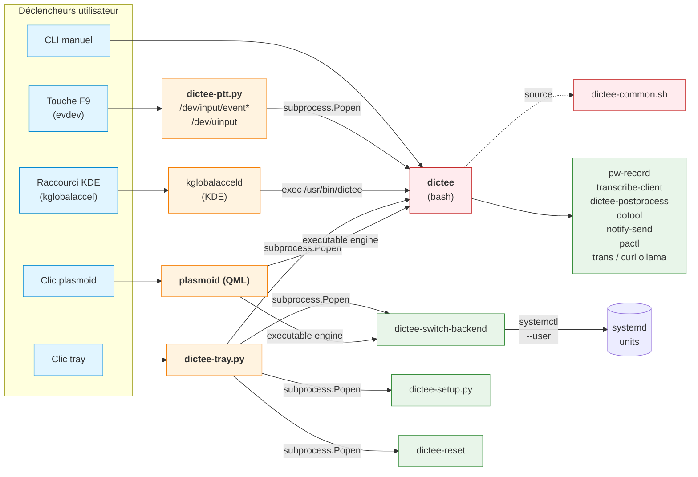

---

## 4. La carte complète des fichiers d'état / IPC

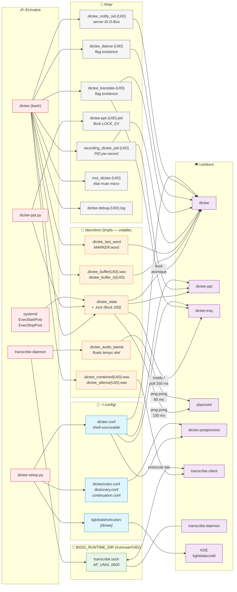

### Fiche par fichier

| Chemin | Contenu | Écrivain | Lecteur(s) | Protection | Nettoyage |
|---|---|---|---|---|---|
| `/dev/shm/.dictee_state` | mot-clé d'état | `dictee`, `dictee-ppt`, services | tous | `flock -n 200` sur `.dictee_state.lock` | reboot (tmpfs) |
| `/dev/shm/.dictee_state.lock` | *vide* | — | `write_state()` | lockfile | reboot |
| `/dev/shm/.dictee_buffer{UID}.wav` | WAV pré-enregistrement | `dictee` | `dictee` (concat) | — | `cleanup_session()` |
| `/dev/shm/.dictee_buffer_ts{UID}` | timestamp UNIX | `dictee` | `dictee` | — | `cleanup_session()` |
| `/dev/shm/.dictee_combined{UID}.wav` | WAV fusionné diarisation | `dictee` | `transcribe-client` | — | `cleanup_session()` |
| `/dev/shm/.dictee_silence{UID}.wav` | silence de jointure | `dictee` | `dictee` (concat) | — | `cleanup_session()` |
| `/dev/shm/.dictee_last_word` | `MARKER:mot` | `dictee` `save_last_word()` | `dictee` `apply_continuation()` | — | persistant |
| `/dev/shm/.dictee_audio_bands` | floats temps réel | `transcribe-daemon` | plasmoid (FFT) | overwrite continu | — |
| `/tmp/recording_dictee_pid-{UID}` | PID `pw-record` | `dictee` | `dictee-ppt` | — | `stop_recording()` |
| `/tmp/dictee_translate-{UID}` | *vide* (flag) | `dictee` | `dictee-tray`, `dictee` | — | `cleanup_session()` |
| `/tmp/dictee_diarize-{UID}` | *vide* (flag) | `dictee` | `dictee` | — | `cleanup_session()` |
| `/tmp/dictee-ppt-{UID}.pid` | PID du daemon PTT | `dictee-ppt` | `dictee-ppt` (self) | `fcntl.LOCK_EX \| LOCK_NB` | `atexit()` |
| `/tmp/.dictee_notify_sid-{UID}` | server ID D-Bus | `notify_dictee_async` | `close_notification` | — | fermeture notif |
| `/tmp/mut_dictee-{UID}` | `muted=1` | `dictee` | `restore_audio()` | — | `restore_audio()` |
| `/tmp/dictee-debug-{UID}.log` | logs `_dbg()` | `dictee-common.sh` | humain | append | manuel |
| `$XDG_RUNTIME_DIR/transcribe.sock` | — (socket) | `transcribe-daemon` | `transcribe-client` | 0600, `AF_UNIX` | unlink à l'arrêt |
| `~/.config/dictee.conf` | env vars | `dictee-setup.py`, `dictee-switch-backend` | tous (source) | 0600 | — |
| `~/.config/kglobalshortcutsrc` | `[dictee]` | `dictee-setup.py` (`kwriteconfig6`) | kglobalacceld | INI | — |

---

## 5. Socket `transcribe.sock` — protocole

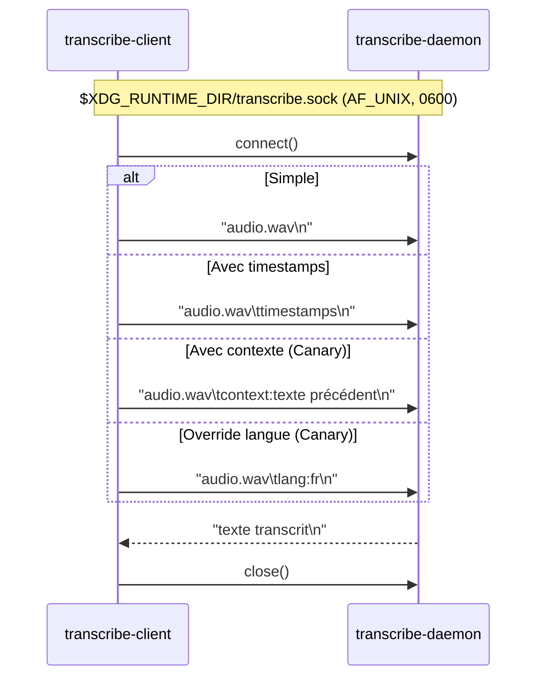

---

## 6. Machine à états — transitions exactes

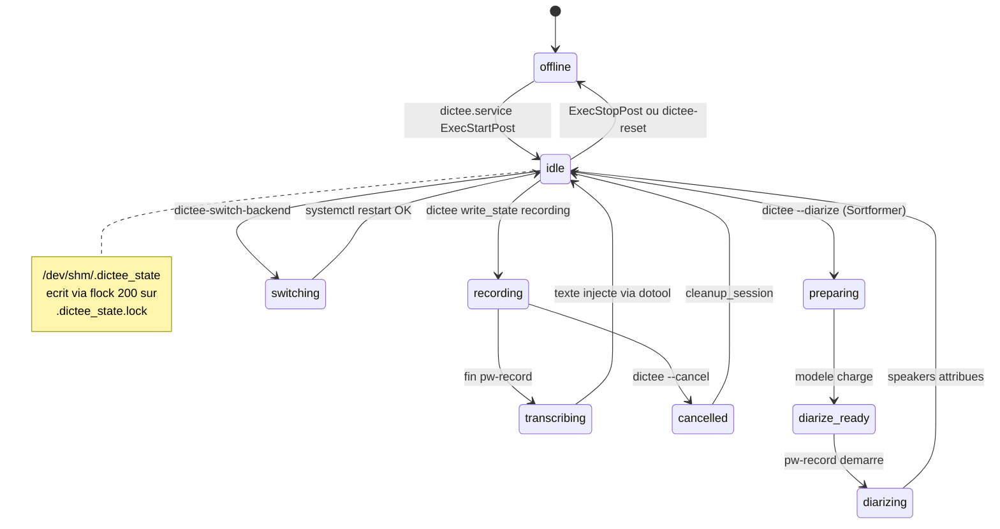

**Écrivains légitimes de l'état** : `dictee` (`write_state()`), `dictee-ppt` (via même lib), services systemd (`ExecStart/StopPost`), `dictee-switch-backend`.
**Lecteurs** : tous, sans verrou (lecture = ≤ 16 octets, atomique de facto).

---

## 7. D-Bus — notifications et raccourcis

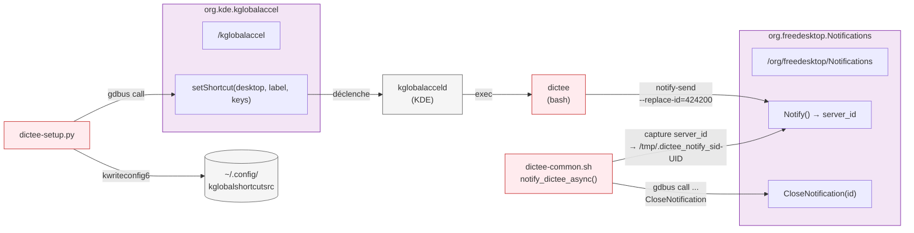

**Points clés** :
- **ID de remplacement fixe** : `NOTIFY_ID=424200` (défini dans `dictee-common.sh:23`) — une seule notif dictée visible à la fois.
- **Fermeture fiable** : on stocke le `server_id` retourné par `Notify` dans `/tmp/.dictee_notify_sid-{UID}`, puis on appelle `CloseNotification(server_id)` via `gdbus` — contourne le bug KDE qui ignore `replace-id` sur les notifs expirées.
- **Aucun D-Bus** pour l'état dictée (pas de signal/property) : polling fichier + `flock`.

---

## 8. Raccourcis globaux — les deux voies

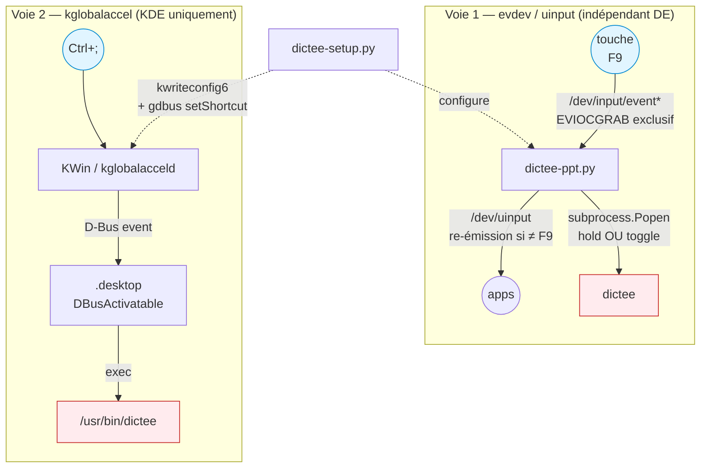

| Voie | Portée | Mode | Permissions requises |
|---|---|---|---|
| **evdev + uinput** (`dictee-ppt`) | tout DE (X11/Wayland, KDE/GNOME/…) | hold **et** toggle | groupe `input`, udev rule `/etc/udev/rules.d/80-dotool.rules` |
| **kglobalaccel** (KDE) | KDE Plasma uniquement | toggle (press) | aucune |

---

## 9. Boucles de polling — fréquences

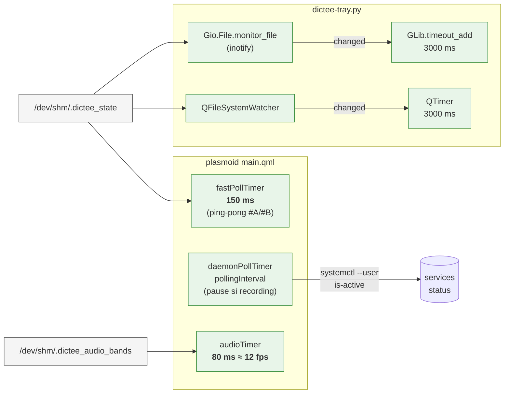

---

## 10. Anatomie d'une dictée — tous les fichiers touchés

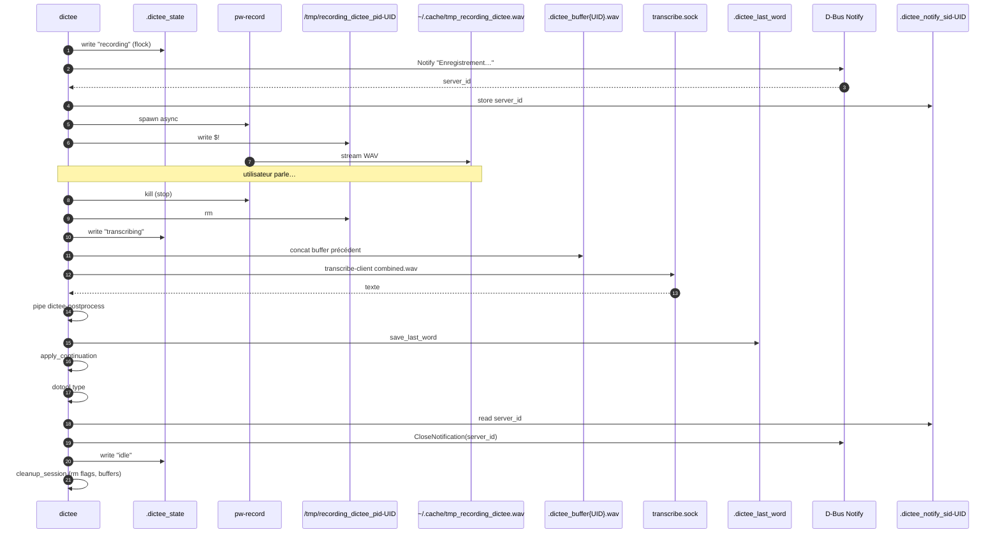

---

## 11. Install / uninstall — impact système

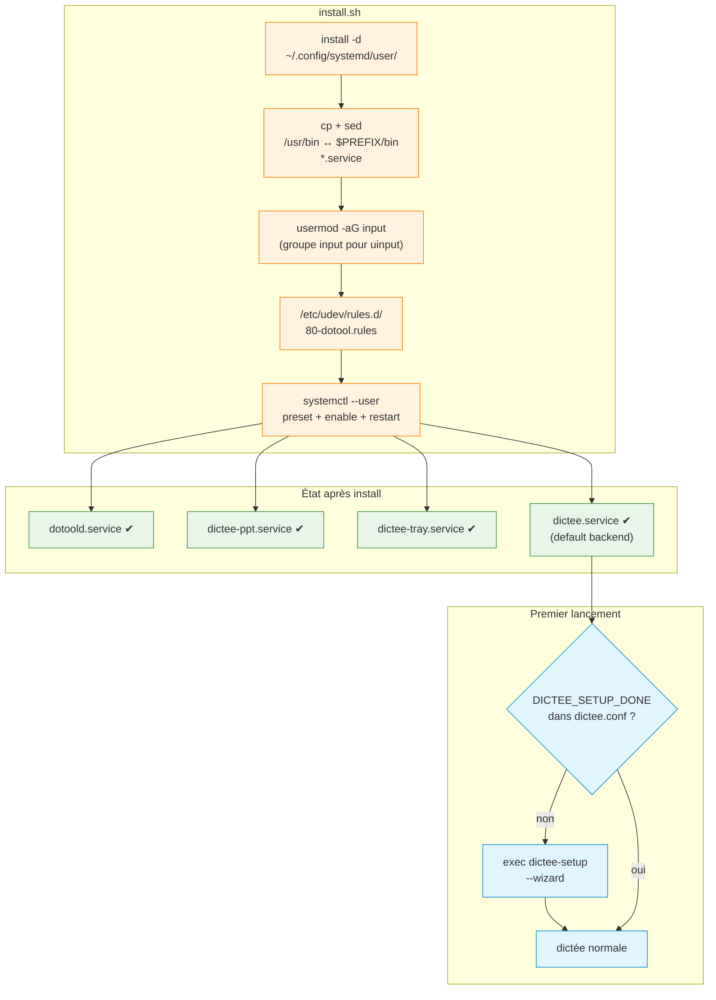

---

## 12. Matrice récapitulative *qui parle à qui*

| De ↓ / Vers → | `dictee` | `transcribe-daemon` | `dictee-ppt` | `dictee-tray` | plasmoid | systemd |
|---|---|---|---|---|---|---|
| **utilisateur** | CLI / KDE shortcut | — | F9 (evdev) | clic | clic | — |
| **`dictee`** | — | socket Unix | `/dev/shm/.dictee_state` | `/dev/shm/.dictee_state` | `/dev/shm/.dictee_state` | (lance `systemctl` si daemon absent) |
| **`dictee-ptt`** | `Popen("dictee")` | — | — | état | — | — |
| **`dictee-tray`** | `Popen("dictee [--translate/--cancel]")` | — | — | — | — | — |
| **plasmoid** | `executable.run("dictee")` | — | — | — | — | `systemctl --user enable/disable` |
| **`dictee-setup`** | — | — | `dictee.conf` | `dictee.conf` | — | — |
| **`dictee-switch-backend`** | — | restart service | — | — | — | `systemctl --user` |
| **`transcribe-daemon`** | réponse socket | — | — | — | `/dev/shm/.dictee_audio_bands` | `ExecStartPost → idle` |
| **systemd** | — | lance/arrête | lance/arrête | lance/arrête | — | — |

---

## 13. Points de panne potentiels (aide-mémoire)

| Symptôme | Point à vérifier |
|---|---|
| Icône systray « offline » alors que daemon tourne | `systemctl --user status dictee` + `cat /dev/shm/.dictee_state` (écrit par `ExecStartPost` ?) |
| F9 ne déclenche rien | Groupe `input` (`id | grep input`), `systemctl --user status dictee-ptt`, lockfile `/tmp/dictee-ppt-{UID}.pid` |
| Texte non injecté | `dotoold.service` actif ? udev rule `/etc/udev/rules.d/80-dotool.rules` ? |
| Notif reste à l'écran | `/tmp/.dictee_notify_sid-{UID}` lu ? `gdbus call … CloseNotification` OK ? |
| Deux backends ASR simultanés | `Conflicts=` violés → `systemctl --user list-units dictee*` |
| État figé « recording » | `flock` laissé bloqué sur `.dictee_state.lock` → `rm /dev/shm/.dictee_state*` + reset service |
| Plasmoid ne se rafraîchit pas | ping-pong source (`#A`/`#B`) bloqué → redémarrer plasmashell |
| Socket refusé | `ls -l $XDG_RUNTIME_DIR/transcribe.sock` (0600, présent ?) |
| Raccourci KDE perdu | `~/.config/kglobalshortcutsrc [dictee]` + `gdbus call setShortcut` |

---

*Généré le 2026-04-15 — dictée v1.3.0 / master. Complète `architecture-pile.md`.*
